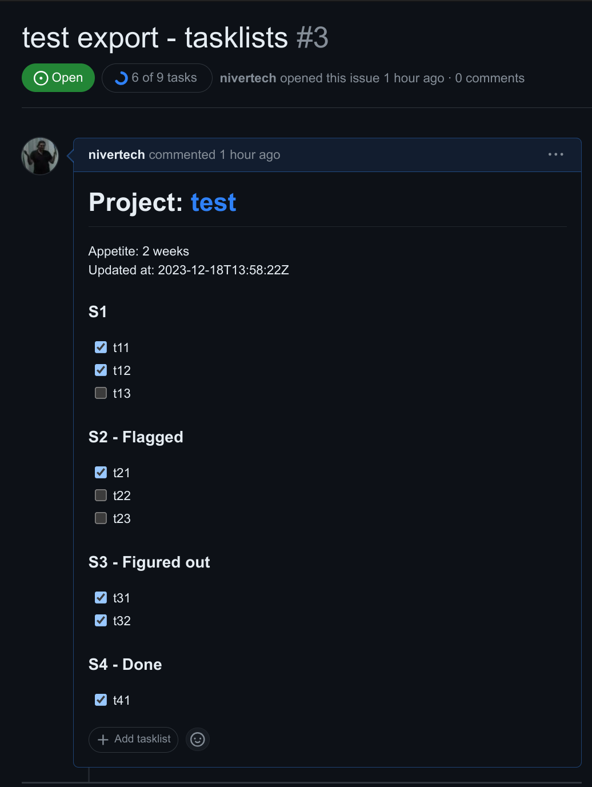
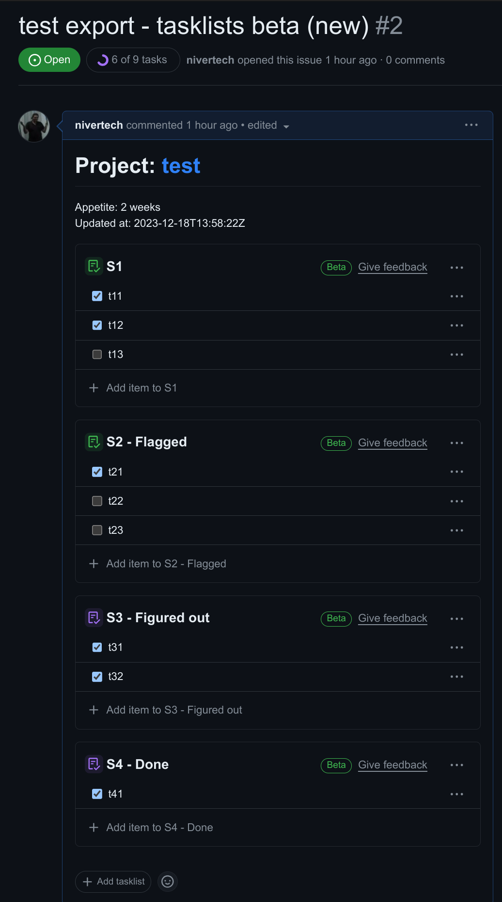

# dumplink_export

## How to use:

```bash
curl https://dump.link/api/v1/projects/PROJECTID?token=TOKEN > project.json

node export.js project.json > issue.md

# or copy to clipboard and paste into new GH issue
node export.js project.json | xclip -sel clip
```

## GitHub tasklist format (current):


Example issue: https://github.com/nivertech/dumplink_export/issues/1


Will look like this:




```markdown
# Project: [test](https://dump.link/a/PROJECTID)

Appetite: 2 weeks
Updated at: 2023-12-18T13:58:22Z


### S1 
- [x] t11
- [x] t12
- [ ] t13

### S2  - Flagged
- [x] t21
- [ ] t22
- [ ] t23

### S3  - Figured out
- [x] t31
- [x] t32

### S4  - Done
- [x] t41
```


## GitHub tasklists beta format (new)

NOTE: requires access to private beta

https://docs.github.com/en/issues/managing-your-tasks-with-tasklists/creating-a-tasklist

Will look like this:



```text
# Project: [test](https://dump.link/a/PROJECTID)

Appetite: 2 weeks
Updated at: 2023-12-18T13:58:22Z


```[tasklist]
### S1 
- [x] t11
- [x] t12
- [ ] t13
```

```[tasklist]
### S2  - Flagged
- [x] t21
- [ ] t22
- [ ] t23
```

```[tasklist]
### S3  - Figured out
- [x] t31
- [x] t32
```

```[tasklist]
### S4  - Done
- [x] t41
```
```
